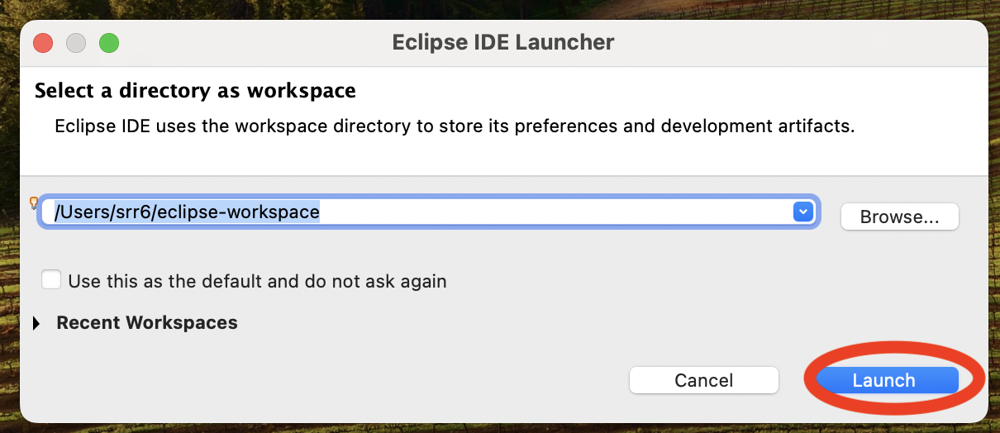
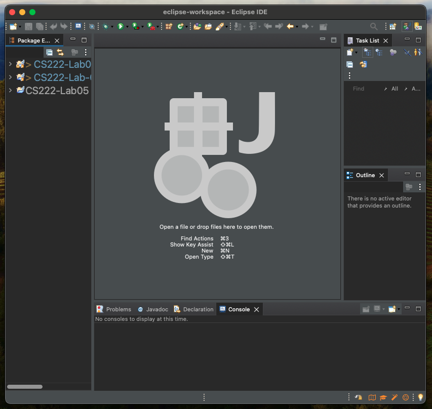
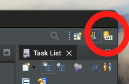
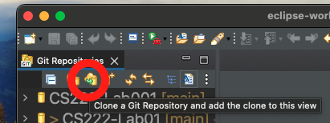
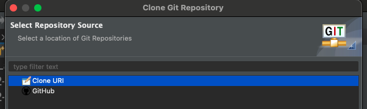
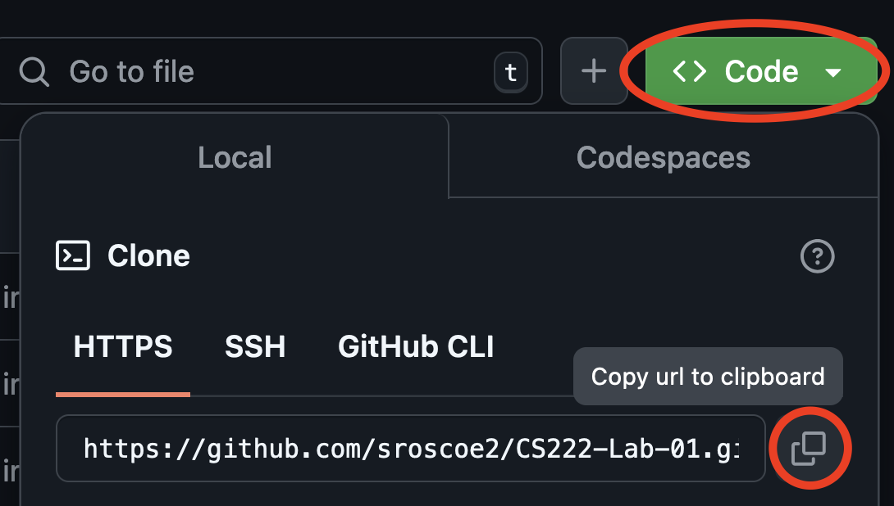
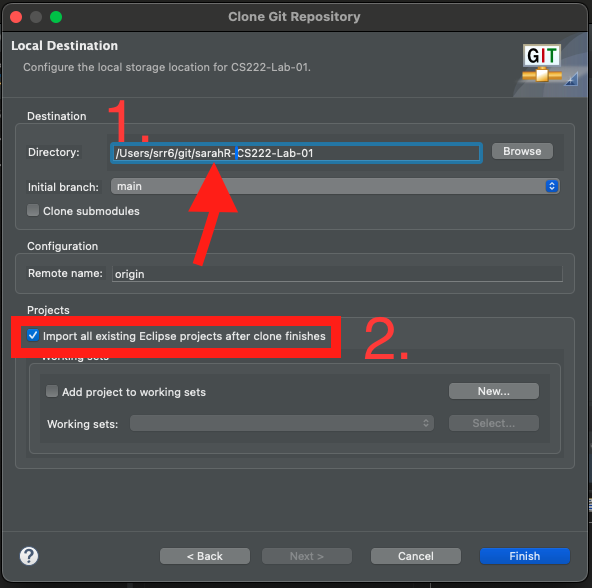
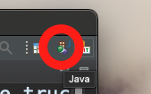
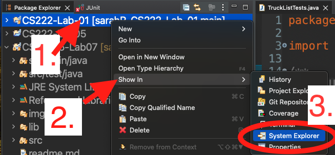

# Programming II

## Lab 1: Introduction

In this lab, you will practice writing for loops, while loops, and using conditionals in the Java language.

This lab is used in CS 222 at Saint Mary's College of California. Written by Dr. Sarah Roscoe in 2024.

This lab has *instructions* and *explanations*. For every instruction, there will be a link to some explanation or hint in a later part of the lab. *Ignore the explanations at your own risk!* Only do so if you're sure you know what you're doing.

There are also some *italicized* words, which are used to denote terminology you may be unfamiliar with. If you have questions about what these words mean, please ask the instructor or a peer tutor.

Pieces of code or names of files and folders are denoted in `code font`.

# Instructions

1. [Explanation](#installing) Install a JDK and Eclipse.

2. [Explanation](#cloning) Clone the lab from Github.

## Beginning.java

3. [Explanation](#opening-files) Expand the `src` folder and `main` package and open the `Beginning.java` file.

4. [Explanation](#printing) Add another print statement to the `main()` method. In the print statement, say something you're looking forward to in this class.

5. [Explanation](#variables) Declare five variables: an `int`, a `double`, a `String`, a `char` and a `boolean`. Give each an appropriate variable name of your choosing. Given the following list of values, assign each value to the appropriate variable:

`987` `'s'` `"Hello class"` `432.51` `true`

## Middle.java

6. [Explanation](#for-loops) Open `Middle.java`. Look at the `for1thru10()` method and figure out what is the *initialization*, *condition*, and *update* steps of the provided loop. Write the correct code snippets in the comment space provided.

7. [Hints](#finding-the-sum) Look at `forSum()`. What should be the initialization, condition, and update steps for a for loop, when we are given the array `arr`? How should we keep track of the sum as we go? Write your answer in comments in the`forSum()` method.

8. [Hints](#finding-the-sum) Implement `forSum()` to sum the given array using a for loop. Replace `return 0;` with `return sum;`

9. [Explanation](#while-loops) Look at `while1thru10()`. There are two questions in block comments similar to what you answered for `for1thru10()`. Answer the questions in the space provided.

10. [Hints](#findingthesum) Look at `whileSum()`. What should be the initialization, condition, and update steps for a while loop, when we are given the array `arr`? How should we keep track of the sum as we go? Write your answer in comments in the`whileSum()` method.

11. [Hints](#findingthesum) Implement `whileSum()` to sum the given array using a while loop. Replace `return 0;` with `return sum;`

12. [Explanation](#junit-tests) Run the JUnit tests to make sure your program is running correctly.
  
## End.java

13. [Explanation](#logic), [Hints](#finding-permit-categories) Open `End.java`. Implement `categorizePermits()`, which returns a String, of which category a permit holder belongs to, depending on a given permit price.

14. [Explanation](#junit-tests) Run the test suite `EndTest.java` and ensure all test cases pass.

## Finishing Up

15. [Explanation](#finishing-up) Zip your project folder and turn it into Canvas.

# Explanations

## Getting Started

### Installing

You may have Java installed on your computer already which *runs* Java programs. To get started with coding Java, you need to install a Java Development Kit (JDK). Here's a link to install an open-source JDK: 

https://adoptium.net/ 

Next, you need to install your IDE (coding environment). You should use Eclipse for this class. Download the Eclipse Installer first:

https://www.eclipse.org/downloads/

NOTE: If you're on a NEW MAC (with an M1+ chip), you should download the AARCH_64 version. For almost any other computer, download the x86_64 version (for Intel chips). Ask the instructor if you're not sure which to get. 

Then, open the installer. Install the "Eclipse IDE for Java Developers". 

Once it's installed, launch Eclipse. Select a workspace (default option is fine), then click "Launch"

<p align="center">

</p>

[Go back to the instructions](#instructions)

### Cloning

Once you've opened an Eclipse window (like so),  

<p align="center">

</p>

On the left is the package explorer, how we navigate our projects and files. The center is where the editor will be. The bottom is the _console,_ which shows the output of our programs. The right hand side currently (on my computer) have the task list and outline, both of which are optional. You can close those two if you want, or leave them open -- doesn't matter.

We need to check out the code from Github. You're encouraged but not required to learn Github for this class. We'll use it for storing the code online. 

The code for this lab lives in the cloud, on the Github website. You'll need to *clone* the lab, which copies the online code to your local computer. That way you can edit and run it. 

To do that, we need to switch to a different _perspective_. Chances are, you start Eclipse in the Java perspective, which is where you can edit and run Java files. That makes sense. We need to switch to the _Git_ perspective, which is where we can clone the code to our computer. 

To do that, click the small icon on the top right that says "GIT":

<p align="center">

</p>

This changes the layout a bit: the package explorer has now been changed to a panel called "Git Repositories". There should be several icons directly below the panel title. Click on the icon with a cloud and green arrow to clone a repository.

<p align="center">

</p>

That makes a box pop up. Select "Clone URI" and hit "Next".

<p align="center">

</p>

Copy the link for this lab an paste it in the URI field.

You can copy it here: https://github.com/sroscoe2/CS222-Lab-01.git
Or, scroll up to the top of this page, click the green button that says `< > Code`, then click the icon to copy the link.

<p align="center">

</p>

Paste the link into the URI field in the "Clone Git Repository" window that's popped up. Click Next. 

**VERY IMPORTANT!!!!!** DO NOT SPEED THROUGH THESE STEPS!

When prompted for Branch Selection, hit next again. 

When prompted for "Local Destination" settings, you are saying where it's going to live on your computer. Change the name of the directory from just "CS222-Lab-01" to add your first name and last initial before the "CS222" bit.

<p align="center">

</p>

So, if my name is Sarah Roscoe, I'm saving the lab as "sarahR-CS222-Lab-01". 

THEN, make sure the "Import all existing Eclipse projects after clone finishes" is CHECKED. Then click Finish.

Click on the button in the top right to go back to the Java perspective.

<p align="center">

</p>

**VERY IMPORTANT!** If you DON'T have that box checked before you click Finish, you need to import it manually. To do that:
1. Go back to the Java perspective
2. Right click in the Package Explorer -> select Import
3. Go to General -> Import projects from folder or archive
4. Click Directory, then navigate to where the project is stored. Eclipse usually saves it in `/Users/git/...`
5. Select the project folder. Just the top-level one, like "sarahR-CS222-Lab-01", not any of its subfolders.
6. Click Open, then Finish in the other dialog box. 

Congrats! If you go back to the Java perspective, you should see your imported project.

[Go back to the instructions](#instructions)

## Beginning

### Opening files

**Expand the src folder.** This is where all your *source code* lives. Within the src folder, there are other folders, which in Java we call *packages*. Double-click on a folder or file to open it.

When you open a file, it'll open in the editor, which is the middle pane in your *IDE* (coding environment).

To run the file, as long as it has a `main()` method, click the green play button. Many lab files will have main methods where you can briefly check if your code is working as desired.

[Go back to the instructions](#beginningjava)

### Printing

There is a single *method*, called `main()` in the `Beginning` class. In Java, we call functions *methods*. Currently, it prints something using `System.out.println()`. This is how we print to the *console*, which can also be called the *terminal*.

`System.out.println()` is equivalent to `print()` in Python. `System.out` controls output to the console. There are several options for printing:

- `print(...)`, which prints things to the console, and *does not insert a new line at the end*. This is equivalent to `print(...,end='')` in Python.

- `printf(...)`, which prints formatted text to the console.

    You can create a formatted string such as the following: `System.out.printf("Hello %s! I am in CS %d", "World", 222);` In a formatted String, you have *placeholders* for variables that you can specify after the string. The formula for a formatted string is as follows:

    `System.out.printf(string,values,...)`. You can have as many comma-separated values as you have placeholders in the string.

    The placeholders begin with a percent sign `%` and are followed by a combination of letters, characters, and numbers. Typically `%s` is used if the variable you're inserting is a `String`, and `%d` is used if you're inserting an integer. You can find more information and options here: <https://www.w3schools.com/java/ref_output_printf.asp>

- `println()`, which is equivalent to `print()` in Python. This option adds a new line to the end of whatever you're printing. This is the one we use most often, but you may switch to another option depending on your preference or needs.

[Go back to the instructions](#beginningjava)

### Variables

In Python, you could define variables like so:

```py
x = 5 # type: int
greet = "hello" # type: str (string)
number = 6.4 # type: float
```

Moreover, you could re-assign any variables later without specifying what their original type is:

```py
x = 6.4 # was: int, now: float
greet = 5 # was: str, now: int
number = "hello" # was: float, now: str
```

Java doesn't let us do this! Every variable in Java has a *type*, and that type must stay the same the whole time we use the variable.

To create a variable, we must first *declare* it. Declaring a variable means we first say what type it is, then we say the variable name:

```java
typename variableName;
```

Now we've reserved a space in memory for our variable `variableName`. But we haven't assigned a value to it. To *initialize* it, we set it equal to something:

```java
int i;
char c;
double d;

i = 6;
c = 's';
d = 3.14;
```

We initialize the variables `i`, `c`, and `d` in the final 3 lines. Now those variables each have values.

We could have just done the *declaring* and *initializing* all in one line, like so:

```java
int i = 6;
char c = 's';
double d = 3.14;
```

The declaration is on the left hand side of the equal sign `=`, and the initialization is on the right hand side.

Note that every statement in Java must end with a semicolon `;` Otherwise you get errors!

In Python, you didn't have to add semicolons. You could just separate lines of code by hitting the `Enter` or `Return` key. Not so here.

The Python equivalent to the previous code would be:

```py
i = 6
c = "s" # " and ' are interchangable in Python
d = 3.14
```

Variable names can be any combination of letters, numbers, and underscores. Java politely ~~requires~~ requests that you start your variable with a lowercase letter. But anything after that is fair game.

There are 8 *primitive* types in Java. They are:

| Python | Python Example | Java | Java Example |
|:------:|:------------------:|:-----------------------:|:------------:|
| int | 6 | byte/short/**int**/long | 4 |
| float | 6.7 | float/**double** | 3.14 |
| bool | True/False | boolean | true/false |
| n/a | "c" or 'c', equiv. | char | 'c' |

These primitive types are very basic data types: an integer number, a floating-point (decimal) number, a boolean (true/false) variable, and a single character. Note that for a `char`, it *must* be encased in only single quotes `' '`! Single quotes in Java mean `char`, while double quotes `" "` mean `String`.

You may notice that `String` (Python equivalent `str`) is not present in this table. `String` is not one of the *primitive type*s listed above, but rather a *reference type*. Reference types are any variable type that is not a primitive. There are infinitely many reference types! We will define many of our own during this class.

To declare a reference variable, it's a similar process as primitives:

```java
Typename variableName;
```

You'll notice the type name starts with a capital letter. That's because it's a reference type. *Reference types always start with a capital letter.*

We'll talk about initializing reference variables in the next lab. For now, just know that `String`s can be initialized similarly to primitive variables. This isn't true for all reference types, but `String` is special!

```java
String s = "hello this is my string";
```

[Go back to the instructions](#beginningjava)

## Middle

### For Loops

In Python, you probably have experience writing `for` loops like this, which prints numbers from 0 to 9:

```py
for i in range(10):
    print(i)
```

The way we write that in Java is:

```java
for(int i=0; i<10; i++){
    System.out.println(i);
}
```

To write a `for` loop in Java, we need 3 components:

1. an *initialization* step, in this case `int i=0`,

2. a *condition*, in this case `i<10`, and

3. an *update* step, in this case `i++`.

Note that Java **requires** the `for` loop to put the components in parentheses `( )`. The components of a `for` loop must be separated by semicolons `;` The code to be executed must be within curly brackets `{ }`
  
#### Initialization

We need a variable to keep track of where we are in the loop. That's why we need an initialization step: we need to know where to start. If we want to use a previously defined variable, we don't need to declare its type (in this case, `int`). But if `i` hasn't been used before (the programmer way of saying that is that `i` "doesn't exist in this *scope* before now"), we have to declare it here.

We didn't have to start `i` at 0. We chose to print the numbers from 0 to 9. If we wanted to print the numbers from 6 to 15, we'd instead have `int i=6`. The initialization step tells the program where to start counting.

#### Condition

A *condition* is something that evaluates to either `true` or `false`. Examples of conditions:

- My shirt is blue.

- It is cloudy right now.

- My favorite TV show is *Stranger Things*.

- Oliver Hall will serve pizza for lunch today.

We can also have conditions for values. Let's say we have a variable `x`, declared and initialized as `int x = 5;`

A condition (something that's either true or false) could be:

- `x < 3` (read "is x less than 3?")

- `x == 10` (read "does x equal 10?")

- `x >= 4` (read "is x greater than or equal to 4?")

The answer to each of these conditions (questions) is either yes or no; true or false.

In Python, true was spelled `True` (capital T) and false was spelled `False` (capital F). In Java, true and false are spelled with lowercase letters, i.e. `true` and `false`. If you spell it right, it'll turn pretty colors in your coding environment.

In a `for` loop, the condition is there to ask "will we continue?" It needs to know, under what circumstances will it do the things within the loop?

For our example, if `i` is how we keep track of where we are, for what values of `i` will we execute the code `System.out.println(i)`? That's determined by the condition. As long as `i<10`, the computer will do whatever is within the curly brackets `{}` which define the loop.

If we wanted to change what numbers we printed, we'd need to change the condition. To print 67 to 103, the initialization and condition could be something like `int i=67; i<104;`

#### Update

We've covered where we start and how long we're doing this. Now we just need to say how to proceed through the loop. The update step is `i++`. This bit of code is saying "add 1 to `i`".

It's equivalent to the following:

```java
i = i+1; // is equivalent to...
i++;
i += 1;
++i; // some difference to i++, but ok for now
```

If we didn't have the update step, we'd stay at `i=0` forever. Then we'd never get anywhere. We need to change the value of `i` as we go through the loop.

We could say, instead, to print the even numbers from 0 to 10. Then our code would be:

```java
for(int i=0; i<10; i+=2){
    System.out.println(i);
}
```

In this way, we add 2 to `i` every time.

[Go back to the instructions](#middlejava)

### While Loops

`while` loops are another way to execute some code repeatedly. Like `for` loops, they need the three components (initialization, condition, and update), but they just go in different places.

Here's a skeleton for a `while` loop:

```java
initialization;
while (condition){
    // code to repeat goes here
    update;
}
```

You can see that even if they're not all in the loop *definition* like the `for` loop, the three components are still there. The initialization happens before the loop starts.  The condition goes inside parentheses after the word `while` (again, the parentheses are *required*). The update step goes inside the curly brackets `{ }`

The equivalent `while` loop code to print numbers from 0  to 10 is:

```java
int i = 0;
while(i<10){
    System.out.println(i);
    i++; 
}
```

See? We use all the same parts! It's just a different loop structure to do the same exact thing.

**Warning:** If you forget to set the initialization and/or update steps, your while loop may run forever, and your computer will be very sad. You may also be very sad that your program doesn't run as expected.

[Go back to the instructions](#middlejava)

### Finding the Sum

We want to find the sum of an array. Here's what we need to do in order to make that happen:

1. Create a variable to hold the sum as we go
2. Go through the array (using a loop).

    2.1. Access the array element

    2.2. Add it to the sum

Here are some hints to get you going:

1. Declare a variable named `sum`. It should be an `int`, because the array I'm giving you is full of `int`s. It'd be weird to add a bunch of ints together and get a decimal number. Initialize `sum` to 0. Why? Does it make sense to start adding numbers together starting at 1, or 4, or 500? Nope. Best to start our count at 0.
2. You'll be instructed to use either a `while` loop or a `for` loop. Please read up on them and use the correct one. You can find the length of the array by saying `arr.length`

2.1. When we go through the array, we'll use an *index* to access its elements. It's the same as using indices in Python:

```java
arr[i]
```

Example: when `i` is 6, when we say `arr[i]` we're actually saying `arr[6]`. Just like Python, Java's arrays (and everything, really) are indexed starting at 0. 

2.2. Remember the equivalent statements for adding 1 to `i`? Specifically, check out `i+=1`. We could change the right hand side (the 1) to add whatever value we want to the `sum` variable. In this case, what are we adding to the sum? the element of `arr`, `arr[i]`.

[Go back to the instructions](#middlejava)

## Logic

In Python, chances are you're familiar with using `if` and `else` statements (and maybe `elif`):

```py
x = 5
if x<4:
 print("small")
elif x>=4 and x<6:
 print("mid")
else:
 print("big")
```

We can do the same behavior in Java! It just looks a tiny bit different. Here's the rules for *conditional statements* (that's what we call the if, else if, and else blocks):

1. If is spelled `if`. Else is spelled `else`. Else if (`elif` in Python) is spelled `else if` (with a space!)
2. Following either `if` or `else if`, there needs to be parentheses `( )`. The logical condition goes inside the parentheses.
3. After the parentheses, we need to have curly brackets `{ }`. The code that goes inside the curly brackets will only execute if the proper condition is met.

**Warning:** You are permitted to omit the curly brackets `{ }` after the conditional statement. But if you do that, it means that only the *first line* of your code that would have been in brackets gets executed. Be cautious if choosing this option: if you've got more than one statement of code to be executed, the later ones will be ignored and will execute regardless if the condition is true!

### Logical operators

You may be familiar with the logical operators AND, OR, and NOT. These are in Java! Just spelled differently. While in Python they were called literally `and`, `or`, and `not`, in Java we say it as `&&` (and), `||` (or), `!` (not). Note that `||` is typed using the "pipe" character on your keyboard, which typically lives above the enter key when you press shift.

With all that, here's what our Python code looks like in Java:

```java
int x = 5;
if(x<4){
    System.out.println("small");
}
else if (x>=4 && x<6){
    System.out.println("mid");
}
else{
    System.out.println("big");
}
```

Note that when we have successive conditional operators (if, else if, else right after each other), the next conditional operator goes *outside* the curly brackets for the previous operator.

[Go back to instructions](#endjava)

### Finding Permit Categories

At Saint Mary's, the price someone pays for a parking permit can depend on whether they are a student, employee, or visitor. Link: <https://www.stmarys-ca.edu/offices-services/campus-safety/parking-transportation>

Students pay roughly $9.91 a month, while employees can pay anywhere from $9.92 to $20.75 per month depending on their salary. A visitor, who pays up to $5 a day, would pay $150 if they parked for 30 days straight. Cars with disability placards don't have to pay for parking permits.

Your job is to use `if`, `else if`, and `else` statements to determine what kind of category someone belongs to depending on what they pay for parking. Assume you are only given one permit price at a time.

You may choose to *hardcode* the values. This would be like saying "if they pay 9.91, they are a student. Otherwise, if they pay 9.92, 11.83, 14.83, 17.83, or 20.75, they are an employee," and so on.

You could also implement a range. Such as: if they pay 9.92, they are a student. If they pay between 9.92 and 20.75, they are an employee, and so on.

How you do it is up to you. But you should use `if`, `else if`, and `else` statements to get it done.

Once you determine what category they belong to, return a string that says their category.

Additionally, if the permit price given to you is not any of these options, you should return "nobody".

Note that for the tests to pass, you must LITERALLY return the strings "Student", "Disabled", "Employee", "Visitor", or "nobody" depending on the case. Capitalization matters. If you return anything else, your tests will fail.

## JUnit Tests

To make grading easier, we'll use *unit tests* a lot of the time. Unit tests are there to check that your code produces the desired results. Most of the time, it relies on output checking. For example, for the sum problems, I've got some arrays of integers, and I know what the sum of those arrays should be. I call your method and give it my array, and expect the sum your code calculates to match mine.

It's hard to debug via JUnit tests. If a test fails, it's only going to tell you that the output didn't match. It won't tell you *why* it didn't match--that's your job!

Additionally, the test cases may not cover every possible *edge case*. There may still be situations where your program does not perform correctly, even though tests cases are passing. Please take the time to study your code and ask yourself if you have covered every possible case of input.

For Lab 1, there are only test cases for `Middle.java` and `End.java`. Here's how to run the test cases:

1. Go to the "Package Explorer" tab on the left hand side of your window. Expand the `src` folder for this lab, then expand the `test` package. Find the appropriate set of test cases you want to run (for `Middle` or `End`). They're very helpfully named (if I do say so myself) `MiddleTests.java` and `EndTests.java`.
2. Double click to open the file.
3. Click the green play button to run all tests.
4. If it didn't open automatically, click on the JUnit tab next to the Package Explorer tab. The left hand side should show you some information. (see picture below) On the top is the report of tests. On the bottom is the failure trace. If all tests pass, you should see green check marks next to each test name. If some tests fail, you'll see gray or blue Xs on the little icons.
 1. You can see why the test failed by looking at the panel below that, the *Failure Trace*. This will tell you why JUnit thinks your test failed. It's very bare bones: if the output doesn't match, the test will fail.

[Go back to Middle instructions](#middlejava) or [Go back to End instructions](#endjava) 


## Finishing Up

When you are done with the assignment, submit it to Canvas. You should zip your entire project file, and then submit the zip file to Canvas. _Do not submit only .java files to Canvas_.

1. Reveal your project in your computer's file explorer ("File Explorer" on Windows, "Finder" on Mac). In the Package Explorer, right-click on the project name. Select , then select "Reveal in Finder" (Mac) or "Reveal in File Explorer" (Windows).

<p align="center">

</p>

2. Right click on the folder name and click "Compress" (Mac) or "Send to -> Compressed (zipped) folder" (Windows).
3. Open a browser window to Canvas: https://stmarys-ca.instructure.com/
4. Login and select our course.
5. Navigate to the "Lab 1" assignment and click on it.
6. Hand in the following file: `firstnameL-CS222-Lab01.zip`
  You can either click to upload files from your file explorer, or you can drag-and-drop the files. You will be able to re-handin the assignment as many times as you want up until the due date.

